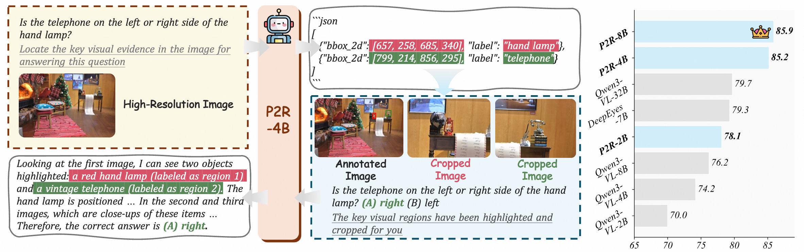
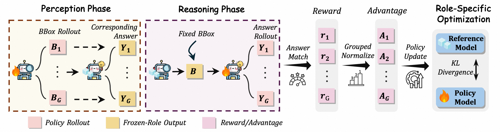
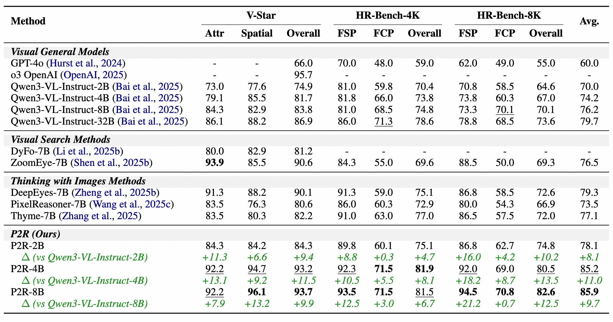
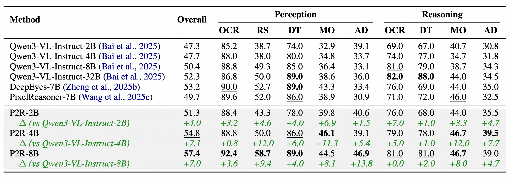

<h1 align="center">
Perceive-to-Reason: Decoupling Perception and Reasoning for
Fine-Grained Visual Reasoning
</h1>
<div align='center' style="font-size:18px;">
<p>
    <a href="https://arxiv.org/pdf/2607.01191v1" target="_blank">
        
    </a>
    <a href="https://huggingface.co/hongxingli/P2R-4B" target="_blank">
        
    </a>
    <a href="https://huggingface.co/datasets/hongxingli/P2R-10k" target="_blank">
        
    </a>
  </p>
</div>


## 🔥 Overview

We introduce **P2R**, a two-stage visual reasoning framework that explicitly decouples perception from reasoning.

<p align="center">
  
</p>

We train P2R with PRA-GRPO, a role-aware alternating RL strategy that converts final-answer correctness into stage-specific supervision.

<p align="center">
  
</p>

P2R consistently outperforms its VLM baselines on both high-resolution fine-grained benchmarks and general multimodal reasoning tasks.

<p align="center">
  
</p>

<p align="center">
  
</p>

## 🎉 News

- **[2026/07/02]** We release our [paper](https://arxiv.org/pdf/2607.01191v1).
- **[2026/07/01]** We release our [code](https://github.com/ZJU-REAL/Perceive-to-Reason), [models](https://huggingface.co/hongxingli/P2R-4B), and [dataset](https://huggingface.co/datasets/hongxingli/P2R-10k).

## 📖 Usage

### Environment Installation

```bash
git clone git@github.com:ZJU-REAL/Perceive-to-Reason.git
cd Perceive-to-Reason

conda create -n perceive-to-reason python=3.10 -y
conda activate perceive-to-reason

bash install.sh
```

### Dataset Installation

**Training Data**

Download the training dataset from [P2R-10k](https://huggingface.co/datasets/hongxingli/SpatialLadder-26k) and place it under your data directory.

**Evaluation Data**

Download the following datasets and place them under your data directory.

- [V-Star Bench](https://huggingface.co/datasets/lmms-lab/vstar-bench)
- [HR-Bench](https://huggingface.co/datasets/DreamMr/HR-Bench)
- [MME-RealWorld](https://huggingface.co/datasets/yifanzhang114/MME-RealWorld-Lmms-eval)
- [MME-RealWorld-Lite](https://huggingface.co/datasets/yifanzhang114/MME-RealWorld-lite-lmms-eval)

### Training

PRA-GRPO alternates between two stages. Each stage keeps the other role **frozen as an inference service**, and requires a **verifier service** for open-ended QA reward.

> **Note:** Before training, configure the service IP addresses and ports in the training scripts (`REASONER_HOST`, `PERCEIVER_HOST`, `VERIFIER_HOST` and their corresponding `_PORT` variables). Ensure each service uses a **different port** to avoid conflicts.

**Stage 1: Train Perceiver**

Start the frozen reasoner and verifier services:

```bash
bash scripts/start_reasoner_server.sh
bash scripts/start_verifier_server.sh
```

Then launch perceiver training:

```bash
bash example/qwen3_vl_4b_p2r/run_pra_grpo_perceiver.sh
```

**Stage 2: Train Reasoner**

Start the trained perceiver and verifier services:

```bash
bash scripts/start_perceiver_server.sh
bash scripts/start_verifier_server.sh
```

Then launch reasoner training:

```bash
bash example/qwen3_vl_4b_p2r/run_pra_grpo_reasoner.sh
```

### Evaluation

Edit `evaluation/run_eval_batch.sh` to specify your model, mode, and task:

```bash
MODEL_NAMES=("your_model")
EVAL_MODE="p2r"          # "default" | "thinking" | "p2r"
TASKS=("V-Star")         # "V-Star" | "HR-Bench" | "MME-RealWorld-lite" | "MME-RealWorld"
```

Then run:

```bash
cd evaluation
bash run_eval_batch.sh
```

## 🙏 Acknowledgement

This project builds on [veRL](https://github.com/verl-project/verl). Training data is sourced from [DeepEyes](https://github.com/Visual-Agent/DeepEyes), [Mini-o3](https://github.com/Mini-o3/Mini-o3), and [Zooming-without-Zooming](https://github.com/inclusionAI/Zooming-without-Zooming). We thank the authors of those projects.

## ⭐️ Citation

If you find Perceive-to-Reason useful, please consider citing our work:

```bibtex

```
